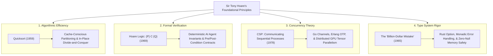

# Foundations of Correctness: A Tribute to Sir Tony Hoare 🏛️

> **A technical exploration of Sir Antony Hoare's foundational contributions—Quicksort, Hoare Logic, CSP, and Type Safety—and their enduring relevance to modern distributed systems and autonomous AI.**

[](https://en.wikipedia.org/wiki/Tony_Hoare)
[](#2-hoare-logic-and-the-promise-of-correctness)
[](#3-communicating-sequential-processes-csp)
[](#4-the-billion-dollar-mistake-and-modern-type-safety)
[](LICENSE)

---

## 🧭 Philosophical Prelude & Systems Perspective

In an industry currently captivated by empirical, probabilistic generative models and trillion-parameter neural nets, it is essential to re-anchor in the mathematical foundations of computer science. Long before modern distributed cloud computing or autonomous agents existed, **Sir C.A.R. (Tony) Hoare** provided the formal bedrock that enables reliable software engineering at scale.

> *"There are two ways of constructing a software design: One way is to make it so simple that there are obviously no deficiencies, and the other way is to make it so complicated that there are no obvious deficiencies. The first method is far more difficult."*  
> — **Sir Tony Hoare (1980 ACM Turing Award Lecture)**

This repository provides clear, executable Python reference implementations demonstrating Sir Tony Hoare's four seminal pillars, drawing direct architectural lineages from his 20th-century breakthroughs to 2026 hyperscale distributed systems.

---

## 🏛️ The Four Pillars & Modern Lineage



---

## 🔬 Technical Deep-Dive & Implementations

### 1. Quicksort & Recursive Elegance (`quicksort.py`)
In 1959, while attempting to translate Russian sentences, Hoare developed Quicksort to sort dictionary entries alphabetically on a machine with tiny magnetic drum storage:
- **Core Mechanism:** $O(n \log n)$ average-time complexity using in-place partitioning with zero supplementary allocation.
- **Modern Relevance:** Quicksort’s cache-locality characteristics make hybrid derivatives (e.g., Dual-Pivot Quicksort, Introsort, pdqsort) the standard default sorting algorithms in modern language standard libraries (C++ `std::sort`, Rust `slice::sort`, Java `Arrays.sort`).

```bash
python3 quicksort.py
```

---

### 2. Hoare Logic and the Promise of Correctness (`hoare_logic.py`)
In 1969, Hoare introduced the **Hoare Triple**:

$$\{P\} \; C \; \{Q\}$$

Where:
- $P$ is the **Precondition** (the state assertion that must hold before execution).
- $C$ is the **Command** (the program transition).
- $Q$ is the **Postcondition** (the state assertion guaranteed to hold upon termination).

**Modern Lineage in AI Safety & Autonomous Systems:**  
In probabilistic AI systems, we cannot formally verify neural network weights, but we *can and must* wrap tool-calling runtimes in deterministic Hoare boundaries. The [Autonomy Boundary Framework](https://github.com/hoomanp/autonomy-boundary) enforces Hoare Logic at Ring 0: asserting that pre-execution grants and post-execution effects form an invariant truth before mutation occurs.

```bash
python3 hoare_logic.py
```

---

### 3. Communicating Sequential Processes (CSP) (`csp_simulation.py`)
In 1978, Hoare introduced CSP, defining concurrency not through shared memory mutexes, but through message passing over synchronous channels:

> *"Do not communicate by sharing memory; instead, share memory by communicating."*

**Modern Lineage in Hyperscale Systems:**
- **Go (Golang):** Goroutines and unbuffered/buffered channels are direct implementations of CSP primitives.
- **Erlang & Elixir (OTP):** The Actor Model shares profound conceptual roots with CSP process networks.
- **Distributed AI Pipeline Parallelism:** Multi-node GPU tensor communication (NCCL AllReduce, Megatron-LM pipeline parallelism) coordinates independent matrix multiplication processes passing activations across interconnects.

```bash
python3 csp_simulation.py
```

---

### 4. The "Billion Dollar Mistake" and Modern Type Safety (`billion_dollar_mistake.py`)
In 2009, Hoare reflected on his 1965 introduction of the `null` reference into the ALGOL W type system:

> *"I call it my billion-dollar mistake. It was the invention of the null reference in 1965... This has led to innumerable errors, vulnerabilities, and system crashes, which have probably caused a billion dollars of pain and damage in the last forty years."*

**Modern Lineage in Systems Engineering:**  
Hoare's candid post-mortem accelerated the modern movement toward algebraic data types (ADTs) and compile-time null safety:
- **Rust:** The complete absence of `null`, replaced with the strict `Option<T>` enum (`Some(T)` or `None`).
- **Modern Python & TypeScript:** Strict typing (`Optional[T]`, `T | null`), non-nullable defaults, and pattern matching.
- **Production Resilience:** Eliminating `NullPointerException` and `SIGSEGV` panics before runtime code reaches production.

```bash
python3 billion_dollar_mistake.py
```

---

## 📂 Repository Topology

```text
TonyH/
├── README.md                      # Foundational Systems Monograph
├── quicksort.py                   # In-place partition Quicksort implementation
├── hoare_logic.py                 # Pre/Post-condition assertion verification
├── csp_simulation.py              # Asyncio CSP message-passing process model
└── billion_dollar_mistake.py      # Null pointer hazards vs. strict type safety
```

---

## 🤝 Tribute & Human Integrity in Tech

Beyond his technical brilliance, Sir Tony Hoare exemplifies the highest standard of intellectual humility and care in engineering. In an age of rapid deployment, his legacy reminds us that true engineering excellence is measured not by speed alone, but by **simplicity, formal correctness, and personal accountability for the systems we build.**

**Curated & Maintained by:** **Hooman Parta** ([@hoomanp](https://github.com/hoomanp))  
Distributed under the **MIT License**.
